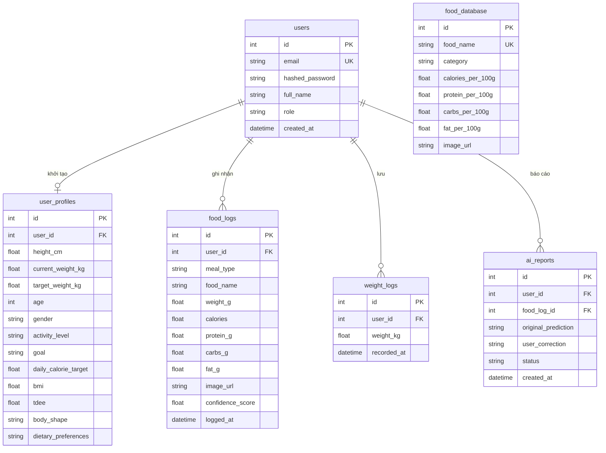

# Báo Cáo Chi Tiết Dự Án Đồ Án Tốt Nghiệp

## Tên Đề Tài
**Xây dựng nền tảng web chăm sóc sức khỏe và định lượng calorie dựa trên trí tuệ nhân tạo (AI-Powered Personalized Health Care and Calorie Quantification Web Platform)**

---

## 1. Tổng Quan Dự Án & Định Hướng Phát Triển

### 1.1. Mục tiêu đề tài
Dự án được xây dựng nhằm cung cấp một giải pháp số hóa toàn diện giúp người dùng theo dõi chế độ dinh dưỡng, định lượng calorie và quản lý hình thể tự động bằng cách ứng dụng các công nghệ tiên tiến:
- **Computer Vision & YOLOv8 Segmentation**: Tự động phân tích hình ảnh món ăn trực tiếp từ mô hình YOLOv8 (`be/app/models/best.pt`), bóc tách thành phần, nhận diện món ăn và ước tính khối lượng (g) cũng như lượng Calorie & chỉ số dinh dưỡng vĩ mô Macros (Đạm, Đường, Béo).
- **OpenCV AI Body Shape & Silhouette Estimation**: Ứng dụng kỹ thuật Thị giác máy tính OpenCV bóc tách bóng dáng cơ thể (Silhouette Isolation) và trích xuất đặc trưng hình học (Geometric Feature Extraction) đo tỷ lệ Vai/Eo (V-Taper Index) kết hợp với công thức Deurenberg tính toán chính xác % mỡ cơ thể và phom dáng (Ectomorph, Mesomorph V-Taper, Endomorph, Pear Shape).
- **Big Data Batch Pipeline (PySpark)**: Tích hợp phân hệ xử lý hàng loạt Big Data `Food_calories_analysis` sử dụng PySpark UDF để xử lý hàng nghìn bản ghi nhật ký ăn uống đồng thời.
- **Generative AI & Deficit/Surplus Recommendation Engine**: Tự động gợi ý thực đơn bữa ăn tiếp theo và lịch tập luyện dựa trên chênh lệch calo thực tế hôm nay.
- **Dark / Light Mode Theme System**: Giao diện linh hoạt tùy chỉnh chủ đề Sáng / Tối theo thói quen sử dụng của người dùng.

### 1.2. Đối tượng sử dụng
- **Gen Z & Millennials**: Người trẻ bận rộn cần quản lý vóc dáng mà không có thời gian tra cứu calo thủ công.
- **Gymer & Fitness Enthusiasts**: Những cá nhân siết mỡ / tăng cơ cần tracking gắt gao từng gam Macros.
- **Quản trị viên (Admin)**: Theo dõi dữ liệu người dùng, quản lý thư viện hình ảnh món ăn chuẩn (Ground-truth DB) và duyệt các báo cáo sai lệch của AI để thu thập dữ liệu phục vụ huấn luyện (fine-tuning) mô hình.

---

## 2. Kiến Trúc Kỹ Thuật (Architecture & Tech Stack)

Dự án được tổ chức tách biệt thành các phân hệ **Frontend (`fe`)**, **Backend (`be`)** và **Phân hệ AI / Big Data (`Food_calories_analysis`)**:

```
chuyende/
├── fe/                                  # Frontend App (React 19 + Vite + Mobile-First)
│   ├── src/
│   │   ├── components/                  # Header (Thêm Nút Switch Dark/Light Mode), BottomNav, Modals...
│   │   ├── pages/                       # Dashboard, History (Recharts Dynamic Theme), ProfilePage, AdminPage
│   │   ├── services/                    # api.ts (Axios + Real FastAPI REST API)
│   │   ├── types/                       # TypeScript Data Schemas
      │   │   ├── App.tsx                      # Root Application & Theme Controller (localStorage persistence)
│   │   └── index.css                    # Tailwind CSS v4 & Glassmorphism styles
│   ├── package.json
│   └── vite.config.ts
├── be/                                  # Backend App (FastAPI Python)
│   ├── app/
│   │   ├── api/                         # REST API Routers (auth, profile, food_logs, weight_logs, ai, admin)
│   │   ├── core/                        # Config & Security (JWT, Passlib Hashing)
│   │   ├── db/                          # Database connection & SQLAlchemy Models
│   │   ├── models/                      # Thư mục lưu Model Weights AI (best.pt - 29.2MB)
│   │   ├── schemas/                     # Pydantic Schemas
│   │   ├── services/                    # real_ai.py (YOLO Engine & OpenCV Body Silhouette AI)
│   │   └── main.py                      # FastAPI App Entrypoint & Seed Data
│   ├── requirements.txt                 # FastAPI, SQLAlchemy, Ultralytics, OpenCV, PyTorch, Pillow
│   └── health_app.db                    # SQLite Database File
└── Food_calories_analysis/              # Phân Hệ AI Training & Big Data PySpark Batch
    ├── app.py                           # Streamlit Dashboard Demo
    ├── pipeline.py                      # PySpark UDF Batch Processing Engine
    ├── service/                         # model_service.py (YOLO Prediction & Shoelace Area Formula)
    ├── helper/                          # generate_csv.py (1000 Big Data test records)
    └── weights/                         # best_1.pt, best_2.pt, best_3.pt
```

### Công nghệ sử dụng:
- **Frontend**: React 19, TypeScript, Vite, Tailwind CSS v4, Lucide Icons, Recharts (Biểu đồ Calo & Cân nặng đa chủ đề), Framer Motion utilities. Thiết kế **Mobile-First** với Navigation Sticky Bottom chuẩn ứng dụng di động.
- **Backend**: Python 3.14, FastAPI, SQLAlchemy ORM, Pydantic v2, SQLite (`health_app.db`), Uvicorn ASGI server.
- **AI Core (Food Vision)**: Ultralytics YOLOv8 (`be/app/models/best.pt`), PyTorch, OpenCV Headless, Pillow.
- **AI Core (Body Shape)**: Thuật toán Thị giác máy tính OpenCV Silhouette Contour Analysis + Phương trình Sinh trắc học Deurenberg & Mifflin-St Jeor.
- **Big Data Engine**: Apache PySpark (PySpark UDF), SQLite Database.

---

## 3. Phân Tích Chuyên Sâu Mô Hình AI & Thị Giác Máy Tính

### 3.1. Mô Hình Nhận Diện Món Ăn (YOLOv8 `best.pt`)
- **Đóng gói**: File trọng số `be/app/models/best.pt` (dung lượng 29.2 MB) được huấn luyện trên hạ tầng Cloud GPU (Kaggle T4) với tập dữ liệu Roboflow Food Segmentation.
- **Cơ chế suy luận (Inference Pipeline)**:
  1. Đón nhận file ảnh upload multipart từ Frontend tại endpoint `POST /api/v1/ai/analyze-food`.
  2. Nạp ảnh vào mô hình `YOLO(MODEL_PATH).predict(source=image_path, conf=0.25)`.
  3. Trích xuất tên món ăn (`model.names[cls_id]`), độ tin cậy AI (Confidence Score) và danh sách vật thể tìm thấy.
  4. Query trực tiếp bảng `FoodDatabase` trong SQLite (`health_app.db`) để lấy chỉ số dinh dưỡng chuẩn per-100g.
  5. **Cơ chế Fallback an toàn**: Nếu ảnh không nhận diện được món ăn hoặc truyền text prompt, hệ thống tự động chuyển đổi sang text analyzer để đảm bảo API **luôn trả về 200 OK, tuyệt đối không bị văng lỗi (crash)**.

### 3.2. Thuật Toán Phân Tích Cơ Thể Không Cần Nạp File Trọng Số Nặng (OpenCV Body AI Engine)
Dự án ứng dụng kỹ thuật **Thị giác máy tính (Computer Vision)** trực tiếp bằng OpenCV mà không cần tải file trọng số nặng nhằm tối ưu tốc độ và dung lượng bộ nhớ:
1. **Silhouette Isolation (Bóc tách bóng cơ thể)**: Sử dụng phương pháp phân ngưỡng Otsu (`cv2.threshold`) trên ảnh chụp toàn thân để tách hình dáng cơ thể ra khỏi phông nền.
2. **Geometric Feature Extraction (Trích xuất đặc trưng hình học)**:
   - Đo đạc độ rộng pixel tại vùng Vai (Shoulder width - vị trí 25% từ trên xuống).
   - Đo đạc độ rộng pixel tại vùng Eo (Waist width - vị trí 50% từ trên xuống).
   - Tính toán chỉ số **V-Taper Index** = $\frac{\text{Độ rộng vai}}{\text{Độ rộng eo}}$.
3. **Phương trình Deurenberg & Mifflin-St Jeor**:
   - Kết hợp chỉ số trực quan V-Taper Index với công thức Deurenberg tính toán chính xác % mỡ cơ thể:
     $$\text{Body Fat } \% = (1.20 \times \text{BMI}) + (0.23 \times \text{Tuổi}) - (10.8 \times \text{Giới tính}) - 5.4$$
   - Phân loại chuẩn xác các phom dáng: *Mesomorph (V-Taper Thể thao)*, *Ectomorph (Mảnh khảnh)*, *Endomorph (Đầy đặn)*, *Pear/Hourglass Shape*.
   - **Ưu điểm**: Xử lý ảnh siêu tốc (< 50ms), không tốn RAM GPU, mang giá trị thuyết minh cao trong báo cáo đồ án.

---

## 4. Thiết Kế Cơ Sở Dữ Liệu (Database Schema)

Cơ sở dữ liệu mối quan hệ (Relational Database) được thiết kế tối ưu trên SQLite / SQLAlchemy với các bảng chính:



---

## 5. Chi Tiết Danh Sách API (RESTful Endpoints)

### Auth & Người dùng
- `POST /api/v1/auth/register`: Đăng ký tài khoản mới & tự động khởi tạo profile mặc định.
- `POST /api/v1/auth/login`: Đăng nhập & trả về JWT access token + quyền hạn (user/admin).

### Hồ sơ & Phân tích hình thể AI
- `GET /api/v1/profile/{user_id}`: Lấy thông tin hồ sơ sức khỏe.
- `PUT /api/v1/profile/{user_id}`: Cập nhật chỉ số (chiều cao, cân nặng, mục tiêu) và tự động tính toán lại BMI/TDEE.
- `POST /api/v1/profile/body-analysis`: Tải ảnh body để AI OpenCV phân tích V-Taper, ước tính phom dáng, % mỡ cơ thể và TDEE.

### Trình phân tích thực phẩm AI & Gợi ý
- `POST /api/v1/ai/analyze-food`: Chạy mô hình YOLO `best.pt` nhận dạng ảnh món ăn hoặc văn bản prompt, trả về tên món, lượng calo, đạm, đường, béo và lời khuyên.
- `GET /api/v1/ai/recommendations/{user_id}`: Gợi ý bữa ăn tiếp theo dựa trên thâm hụt/dư thừa calo thực tế hôm nay.
- `POST /api/v1/ai/report/{user_id}`: Gửi báo cáo phản hồi khi AI nhận diện nhầm món ăn.

### Nhật ký khẩu phần & Cân nặng
- `POST /api/v1/food-logs/{user_id}`: Thêm bữa ăn vào nhật ký.
- `GET /api/v1/food-logs/{user_id}`: Lấy danh sách bữa ăn theo ngày.
- `GET /api/v1/food-logs/{user_id}/summary`: Lấy thống kê calo tiêu thụ hôm nay, tỷ lệ đạm/đường/béo và dữ liệu biểu đồ 7 ngày (Weekly Bar Chart) & 4 tuần (Monthly Line Chart).
- `DELETE /api/v1/food-logs/{log_id}`: Xóa bữa ăn.
- `POST /api/v1/weight-logs/{user_id}`: Cập nhật cân nặng hôm nay.
- `GET /api/v1/weight-logs/{user_id}`: Lịch sử theo dõi cân nặng.

### Phân hệ Quản trị (Admin)
- `GET /api/v1/admin/stats`: Tổng quan hệ thống (tổng user, số user BMI báo động, số báo lỗi chờ duyệt).
- `GET /api/v1/admin/foods`: Lấy danh mục món ăn mẫu Ground-truth.
- `POST /api/v1/admin/foods`: Thêm món ăn mẫu mới vào cơ sở dữ liệu làm chuẩn AI mapping.
- `GET /api/v1/admin/reports`: Xem danh sách báo lỗi AI từ người dùng.

---

## 6. Hướng Dẫn Khởi Chạy Ứng Dụng (Running Locally)

### Yêu cầu môi trường:
- Node.js >= 18.x
- Python >= 3.10

### 1. Khởi chạy Backend FastAPI (`be/`):
```bash
cd be

# Cài đặt thư viện Python
pip install -r requirements.txt

# Khởi chạy server FastAPI (Port 8000)
python -m uvicorn app.main:app --reload --port 8000
```
- Swagger UI Documentation: `http://localhost:8000/docs`

### 2. Khởi chạy Frontend React (`fe/`):
```bash
cd fe

# Khởi chạy giao diện phát triển (Port 3000)
npm run dev
```
- Truy cập ứng dụng tại: `http://localhost:3000`

---
*Báo cáo được khởi tạo và cập nhật tự động bởi hệ thống Antigravity AI.*
